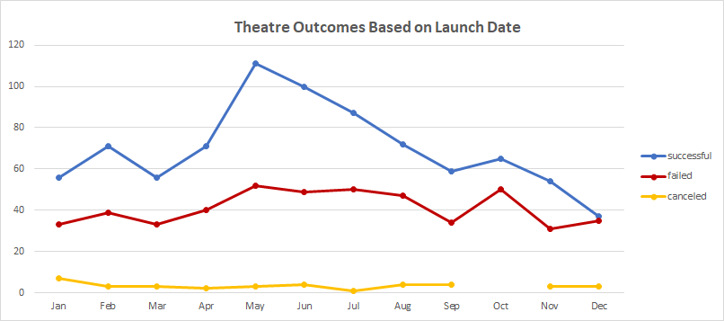
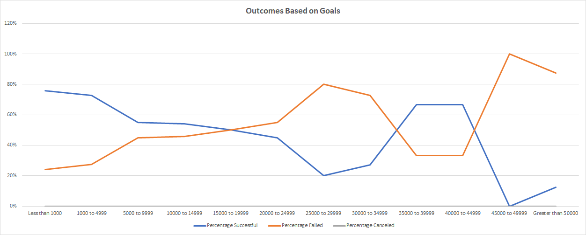

# Kickstarter Campaign Analysis

## Overview of Project 
### Purpose

The purpose in examining this data was for Louise, who is interested in starting her own crowdfunded campaign for her play, Fever. She is interested in how other campaigns in Theatre/Plays, did with their outcomes based on monetary goals and launch dates. This data analysis was performed to help Louise determine which month to launch her crowdfunding campaign, given her planned goal of $12,000. She is interested in the month that has had the highest likelihood of success and how campaigns in her planned goal range, have performed in the past.
	
## Analysis and Challenges 
### Analysis of Outcomes Based on Launch Date
	
The analysis of outcomes based on launch date, determined that the time of year is an important indicator for success. The data in this line graph expresses that launch dates during the months of May, June, & July are best for success. May is the best month, June the second and July the third best for launch.
	

### Analysis of Outcomes Based on Goals

Historical data suggests that if the monetary goal is kept below $5000, there is about a 75% chance of success. On the other hand, if the goal is set at $5000 or higher, but less than $15000, then there is about a 55% chance of success. This analysis indicates that Louise's planned goal of $12000 would have about a 50% likelihood of success. 

### Challenges and Difficulties Encountered

My challenges and difficulties were in the nested functions. The formulas became large in the outcomes based on goals excel sheet. At first, I was hard coding some criterias in the formulas which was tedious and time consuming. I then created intermediate cells that I could reference in the formulas. This made it much easier to complete the analysis. 

## Results 
Two conclusions about the Outcomes based on Launch Date are:

- Based on the launch date historical data, the month of May is the best time for Louise to launch her crowdfunding campaign for her play, Fever. Plays launched in May have had the highest percentage of being successful and May also has had the highest number of campaigns launched. 

- The second conclusion is for Louise to avoid launching a crowdfunding campaign in the month of December, it has had the lowest percentage of success.

 What can you conclude about the Outcomes based on Goals?

- The conclusion for the outcomes based on goals, is that historical data shows that plays with a goal between $5000 and $15000 have had a %54 success rate. In Louise's case, her planned goal of $12000 would likely have about a 50% rate of success.

What are some limitations of this dataset?

- The donation amount per donor is unknown, therefore using the average donation can be masking skewed distributions. Knowing the donation amount per donor could provide insight into how to advertise the campaign.

- There was no data on how the kickstarter was promoted. For example, through social media platform, email, mail, etc. This data would reveal which promoting method has had the highest level of success.

What are some other possible tables and/or graphs that we could create?

- A pivot table that is like the outcome based on launch date, with the addition of a filter for the monetary range. 
- Another sheet like "the outcomes based on goals" that can show the same results by month, rather than for the whole dataset time frame.

